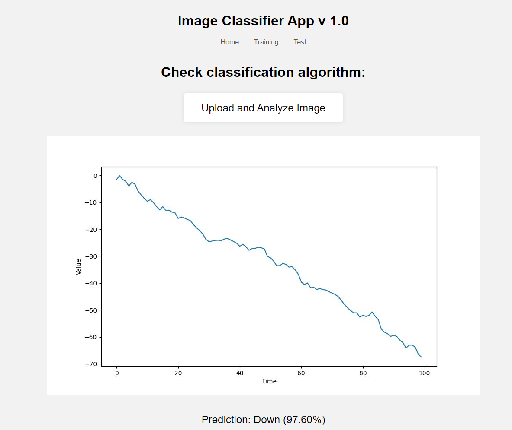

# Image Classification Web App


## Description

This is a web application for image classification based on Flask and TensorFlow. It allows users to upload images and receive predictions about the image's class (e.g., up or down trend).



## Features

- Train a machine learning model based on a set of images and corresponding labels.
- Upload an image for classification and receive a prediction.
- Web-based user interface for easy interaction.

## Installation

1. Clone the repository:

   ```bash
   git clone https://github.com/cyber-data-alchemist/image-classification-web-app.git
    ```
2. Install the required dependencies:
    ``` bash
    pip install -r requirements.txt
    ```
3. Create the db:
    ``` bash
    python db/create.py
    ```
3. Run the application:
    ``` bash
    python app.py
    ```
4. Access the application in your web browser at http://localhost:5000.
5. Classify images in the trainning part
6. Train neural network:
    ``` bash
    python ml/nn.py
    ```
7. Restart application:
    ``` bash
    python app.py
    ```
8. Now you can use the test to make predictions of charts

## Usage
Trainning: Access the "Trainning" page to train the machine learning model based on a set of labeled images.
Test: Access the "Test" page to upload an image and receive a prediction about its class (up or down trend).

## License
This project is licensed under the terms of the MIT License.

## Author
Name: Jorge Luis Arroyo Chavelas

GitHub: https://github.com/cyber-data-alchemist

LinkedIn: https://www.linkedin.com/in/jorge-luis-arroyo-93803373/


## Acknowledgements
[Flask](https://flask.palletsprojects.com/en/2.3.x/)

[TensorFlow](https://www.tensorflow.org/)